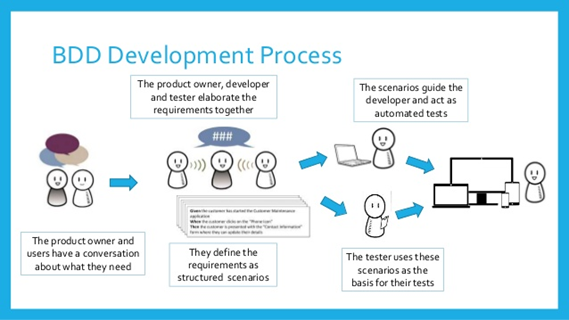
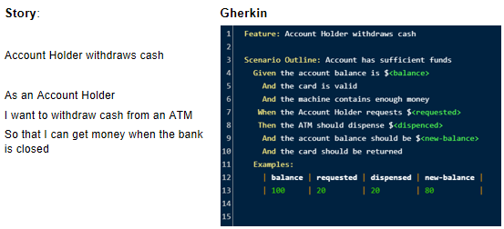

# Cucumber Dojo

This dojo tells a history of how important is to test the code and how we can test using BDD methodology and Cucumber.

## Presentation

### Why should I test before code

- It forces the team to clearly define problems
- It will allow you to write less code
- It will save you hours of debugging/maintenance/regression testing time
- It creates a living documentation

#### Comments while presenting

Who here has a habit of writing tests before starting coding?

Well, most programmers don't like to write tests, especially when they are starting this test journey. But it is very important to write the tests and write them BEFORE you start coding.

 1. clearly define problems
   Who here has already taken a task and in the middle of development had to stop to ask for more information, and the new explanations did not have much to do with the initial task?
   Well, when you create test scenarios during the creation of the stories, you make the scope of the work clearer for the whole team. You get to know exactly what a feature should do. And you end up having all the information you need to make the best coding decisions.

 2. write less code
   You just need to write enough code to pass the tests. Tests make it difficult for us to deviate from what was asked for, and it helps us focus on what should be delivered.

 3. save you hours of debugging
   Have you ever made a change to the code that you thought was small, and it changed the behavior elsewhere? Have you ever stood looking at the computer trying to understand why a function isn't doing what it should be doing
   Have you already deployed on a Friday night and spent the early hours trying to find the problem?
   Well, the tests help us a lot to prevent these problems that are common, just run the tests in the application and you will know if your change that you did has broken something else.

 4. living documentation
   Have you already read a comment in the code that doesn't make any sense? The famous ctrl c + ctrl v 
   When you have tests done well they describe the feature. This helps to have documentation that reflects exactly what the code does, unlike loose comments in the code.

### What is BDD metodology

- Behavior-driven development (BDD) is an Agile software development methodology in which an application is documented and designed around the behavior a user expects to experience when interacting with it.
- BDD helps prevent overgrowth of task scope and unnecessary features or lack of focus.

#### Comments while presenting
  
BDD is an agile methodology, where the application is developed based on the behavior that the user expects. 

Usually, BDD starts with the Product Owner (PO) by talking to users who use or are going to use a system. In this conversation, he tries to understand what they need and what are the pains.

After the PO understands what the demands are, the team meets to understand what are the requirements of each demand (This can occur during the backlog refinement). 

Together they define the scenarios where the user will interact with the system. These scenarios guide development and serve as tests. 

This process helps to focus on what needs to be delivered and prevents the scope of the task from growing unnecessarily.

### What is Gherkin

- Gherkin is a language that is used to define tests in Cucumber.
- It’s meant to describe use cases for a software system in a way that can be read and understood by the entire team.
The language makes it easy to create simple documentation of the code that’s being written

#### Comments while presenting

Gherkin is the language used to define tests in Cucumber.

It is a natural language very close to the spoken language. Because of this characteristic, everyone on the team can understand and help write scenarios.

In addition, as we will see later, it creates live documentation of how the system's functionality should behave when a user interacts with it.

### How to write gherkin tests

- Gherkin uses a set of keywords to describe a feature and scenarios.
- Feature: It´s the start point and provides a feature description. Also is used to group scenarios.
- Scenario: Describe user behaviors
- Step: It´s is a small piece that needs to be done in order to complete a scenario
- The most common steps are:

  - Given: Sets the scene for a scenario. Gives the system context before a user starts interacting with the system.
  - When: Are action steps. They describe an event.
  - Then: Are outcome steps. They describe what you want the system to do. It´s used to compare what is expected and the software outcome.
  - And, But: It´s used to add several steps in a scenario

#### Comments while presenting

In Gherkin, we have a set of words that we use to describe the features of the system.

We always start with the word feature followed by the name of the feature, and as an option, we can put a description on the other line.

Then we start to describe the scenarios. They must start with the word scenario.

A scenario is made up of steps that are small pieces that must be done before completing a scenario.
  
The most common steps are:

- Givem: which describes the context of the scenario before the user interacts with the system 
- When: which describes an event, it can be the user interacting with the system or an event triggering
- Then: which describes what you want the system to do, such as a message appearing on the screen. 
- And and But: used to group several steps

### What is cucumber

- Cucumber is an open-source software testing tool that supports BBD.
- Cucumber reads Gherkin tests and validates that the code performs as it should.
- Cucumber supports a variety of different programming languages including java and javascript.

### Living Documentation

- Living Documentation is a way to share the definition of your features and have a common support dialogue for your business and technical team members
- [Cucumber Jira plugin](https://cucumber.io/living-documentation/?wvideo=6vohcg54f3)

#### Comments while presenting

“Code  never lies, comments  sometimes do.” — Ron Jeffries (Is one of the three founders of the Extreme Programming (XP))

Sometimes we write documentation or comments in our code, but that does not guarantee that the next person who changes the code will also change the comment.

With the BDD methodology and cucumber, we create live documentation. When a developer changes a business rule he must change the tests, so the tests will always be a good guide of what that function should do.

### Questions

#### Is BDD replaces TDD ?

- In TDD the tests are written to check the implementation of functionality.
- In BDD the tests are written to check the behavior of the system from the end-user perspective.

##### Comments while presenting

Not exactly. The community understands BDD as an evolution of TDD.

Both put the test as the beginning of everything. The difference is that one tests the implementation of a feature and the other tests the behavior of the system. In a more complex system, testing only the functionality can generate false positives.

The BDD because it is written in English makes it easy for everyone to understand the documentation.

## How to execute this project

- Clone this repo
- Run npm install and npm run test to run the tests
- It will be created an HTML file with the test results. You can check this file inside `test\features\support\report`
- You can also create a Jira Project and use `Pro Behave` or `Cucumber for Jira`plugins to generate a nice live documentation integrated with Jira 

[Behave Pro]([https://help.hindsightsoftware.com/en/articles/1282564-automating-bdd-scenarios](https://help.hindsightsoftware.com/en/articles/1282564-automating-bdd-scenarios))  

## Dojo branch

You can use this branch to practice
Follow the TODOs to finish the challenge

- Branch: feature/dojo